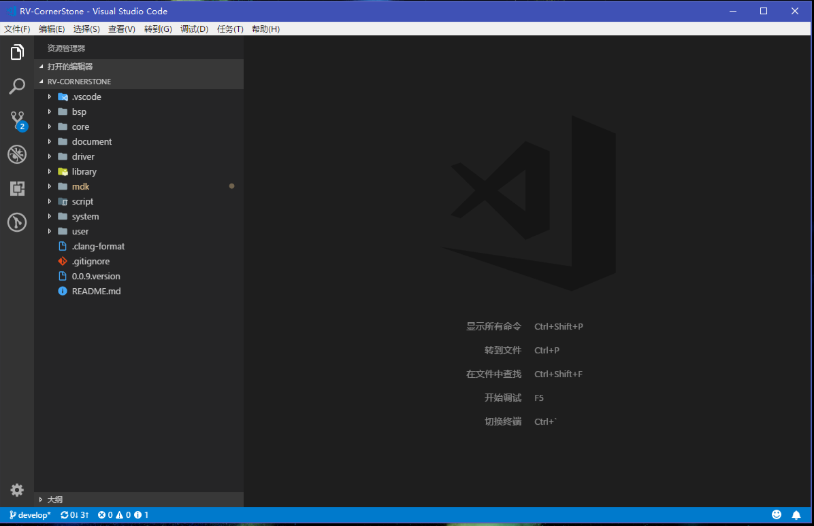

# 电控开发入门

Tccoin @ 2018-08-08

电控标配：

- Keil uVision (编译+烧录)
- VS Code (码代码)
- Git/Github (版本管理)

目前程序文件一律用utf-8编码，代码规范参考doc/华工代码规范.pdf，Git分支管理模式参考GitFlow。

## Keil uVision

安装根据正点原子的教材*来就行了，这里不罗嗦。关键是装好以后在MDK中依次选择Edit - Configuration - Editor - Encoding-Encode in UTF-8 without signature来以utf8格式正确打开并保存文件。 

* 链接: https://pan.baidu.com/s/1sXSji659bNp5zd0s_x18kw 提取码: is2u

## VS Code

VS Code真是我用过最牛X的编辑器了！微软牛X！





### 功能

最左边一排图标依次是：

- 资源管理器
- 全局搜索/替换
- Git
- 调试
- 插件
- GitLens（这是个插件）
- 设置（最下面那个齿轮）

**设置**

[必须] 点开设置，在右边的用户设置里粘贴：

```json
{
    "search.exclude": {
        "**/.git": true,
        "**/mdk": true,
        "**/document": true,
        "**/library": true
    },
    "files.trimTrailingWhitespace": true,
    "files.autoGuessEncoding": true,
    "editor.formatOnSave": true
}
```

**插件**

推荐安装以下几个：

- C/C++ 

  [必须]集代码格式化、调试等等等等功能于一身的全能插件

- C/C++ Snippets

  装了以后输for可以用插件补全一整段for语句，还有一些类似的语句都支持，便于偷懒

- Include Autocomplete

  在你引用头文件的时候自动补全头文件名字，很暖很贴心

- GitLens

  VS Code已经集成了Git中分支管理等许多功能，这个插件更集成了Git Blame这样的功能，可以看见每一行代码的变更历史。非常变态的插件

除了装插件的话，希望大家多熟悉下**快捷键**，下面写几个最常用的，别的用得比较多的操作也可以自己搜以下快捷键是啥，对提高效率很有帮助。

**Ctrl+Alt+F 格式化代码**	**Ctrl+S 保存** Ctrl+F 搜索	Ctrl+H 替换 Ctrl+\ 分屏		Alt+左键 多光标 Ctrl+C 复制	Ctrl+X 剪切	Ctrl+V 粘贴

你们搞得这些快捷键啊，exciting！写代码的时候多按几次，代码写得肯定又快又好。

## Github

### 了解Github

打开任意一个项目页面，你可以看到下面几个栏目。

- `code`是大家最熟悉的一个页面了，就是看代码的页面
- `issue`就是讨论区，可以提出各种功能建议和bug以供讨论
- `pull request`就是提出申请来合并代码，比起直接合并好处在于可视化更直观，并且可以允许其他人参与代码review一起做出决定
- `projects`就是用来跟踪项目进度的
- `wiki`是用来写教程的地方，我们用不上

### 最佳实践

合理运用Github的几大功能可以实现自动化跟踪项目进度，花最少的时间管理项目进度。具体就是projects会自动根据pull request和issue的状态来记录项目进度。

请根据以下流程来进行日常开发工作：

**每天起床第一件事**
- 先fetch一下develop分支，保证和远程仓库同步

**有任何想法**
- 建一个issue来描述当前要实现的功能或是遇到的问题
  - 设置`Assignees`来通知与该issue相关的其他人
  - 设置`Tags`来方便归类
  - 设置`Projects`来实现自动项目进度管理

**开始开发新功能**
- 基于develop分支新建一个feature分支，发布
- 功能开发过程中多commit，在commit message中说明进度
  - 尽量在commit message中链接相关的issue，方法是` #issue_number `注意前后要有空格
  - 示例：`0.1.0 #10 更新xxx`
- 功能开发完成后，在github新建一个pull request (develop <-- feature)
  - 设置`Projects`来实现自动项目进度管理
- 在确认无误后在pull request页面中进行合并
  - 如果develop分支在feature分支分流之后更新过则需要选择rebase

issue的新建与关闭、pull request的新建与完成都会被projects自动记录，这样使用projects就能进行项目进度跟踪，不需要再花时间更新todo。
